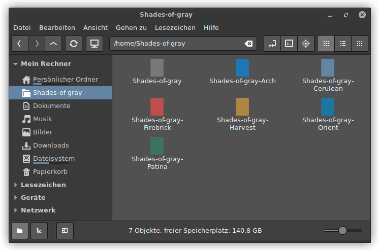

# Shades-of-gray

Shades-of-gray is a flat dark GTK-theme with ergonomic contrasts. It supports Gnome, Xfce4, Mate and Openbox.
Theme customizations for Firefox, Thunderbird and Inkscape are additionally included.
Shades-of-gray is available in seven color variants:

* Gray
* Arch
* Cerulean
* Firebrick
* Harvest
* Orient
* Patina

(*More screenshots at [opendesktop.org](https://www.opendesktop.org/p/1244058)*)

## Installation
**Arch Linux:** You can install the AUR package [gtk-theme-shades-of-gray](https://aur.archlinux.org/packages/gtk-theme-shades-of-gray)

### Manual Installation
Copy the chosen theme folders either for personal use into directory `~/.themes/` or for common use into `/usr/share/themes/`.

### Gadgets

Each theme folder contains an `app-gadgets` directory with additional theme files for Thunderbird, Firefox and Inkspape.

#### Thunderbird
The file `userChrome.css` in folder `Thunderbird-Shades-of-gray` contains a Thunderbird theme adapted to Shades-of-gray. Copy the file or its content to this location:

`~/.thunderbird/<name-of-your-profile>/chrome/userChrome.css`

If you change a Shades-of-gray theme color, it is not necessary to copy the file again. You can simply comment out the current theme color in `userChrome.css` (Thunderbird and Firefox) and comment in the new theme color value.

#### Firefox
The file `userChrome.css` in folder `Firefox-Shades-of-gray` contains some customizations to Shades-of-gray. To enable the customizations, copy the file or its content to this location:

`~/.mozilla/firefox/<name-of-your-profile>/chrome/userChrome.css`

Firefox uses widgets of the current GTK3 theme in websites that have not designed their own widgets for forms.
With dark themes this is ugly and input fields, checkboxes etc. are difficult to use (e.g. black font in dark input fields).
To fix this behavior the file `userContent.css` contains color-neutral form widgets. Copy the file or its contents to this location for enabling:

`~/.mozilla/firefox/<name-of-your-profile>/chrome/userContent.css`

#### Inkscape
Original colored icons in Inkscape are hard to identify in dark themes. The file `icon.svg` in folder `Inkscape-icons` contains bright icons.
To use them in Inkscape, the file must be stored in this directory:

`~/.config/inkscape/icons/icons.svg`

## Requirements
* GTK+ 3.20 or above
* Pixmap theme engine
* Murrine theme engine

## License:
GPL-3.0+